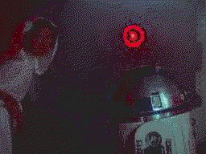
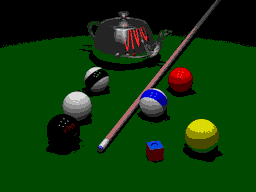
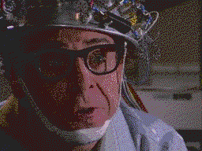
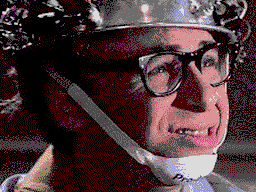
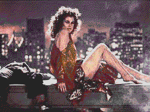
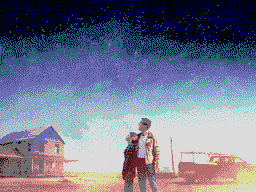
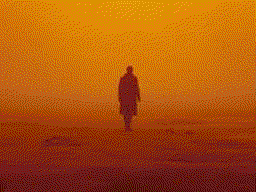

# SAM Coupe Image Reader/Writer

This package contains two command-line converters for SAM Coupe MODE 4 SCREEN$: one for
converting from SAM screens to images (any format supported by Pillow) and the other
to convert images (any format supported by Pillow) to a SAM Coupe screen.

Install with `pip install scrimage` to access two command line utilities:

* `sam2img` converts a SAM Coupe MODE 4 SCREEN$ to an image.
* `img2sam` converts an image to a SAM Coupe MODE 4 SCREEN$

See [this writeup for more information on how the conversion works](https://www.mfitzp.com/article/sam-coupe-image/).

## SAM2IMG

```
usage: sam2img [-h] [--format {png,bmp,gif}] [--outfile OUTFILE]
               screen [screen ...]

Convert SAM Coupe SCREEN$ files to image (PNG, BMP or GIF formats).

positional arguments:
  screen                source SCREEN$ file(s) to process.

optional arguments:
  -h, --help            show this help message and exit
  --format {png,bmp,gif}, -f {png,bmp,gif}
                        Output file format, one of (PNG, BMP, GIF).
  --outfile OUTFILE, -o OUTFILE
                        Output file. Will output to {filename}.ext if not
                        provided.
```

The format for the output is taken from the filename extension by default. This supports
any file type recognised by Pillow. The format can be overridden (to PNG, BMP or GIF) by passing the `-f` argument.

SAM Coupe SCREEN$ contain two palettes, which are alternated between to create flashing effects. Normally,
these palettes are identical (no flashing). If you try and export a SCREEN$ containing flashing palettes to
a static image format (PNG, BMP, etc.) you will see a warning. To capture the flash animation export to GIF.

## IMG2SAM

```
usage: img2sam [-h] [--interrupts] [--dither] [--outfile OUTFILE]
               image [image ...]

Convert Image to SAM Coupe SCREEN$ format. Optional interrupt optimizations.

positional arguments:
  image                 source image file(s) to process.

optional arguments:
  -h, --help            show this help message and exit
  --interrupts, -i      Add (automatic) interrupts to maximise image colors.
  --dither, -d          Dither image using SAM palette before reducing colors.
  --outfile OUTFILE, -o OUTFILE
                        Output file. Will output to {filename}.scr if not
                        provided.
```

Converts the input image file to a SAM Coupe MODE SCREEN$ file. The provided image
is resized and cropped to fill the 256x192 screen with no border, you can pre-size images or
crop them before passing to control the resulting image better.

Passing `-d` or `--dither` will apply a dither to the image, using the SAM Coupe 127 color
palette. This is usually a good idea for photographic images, although it will reduce
the effectiveness of the line interrupts.

Passing `-i` or `--interrupts` will add line interrupts to change palette colors at specific
y locations in the image, resulting in > 16 color images. This is an automatic optimization,
which re-generates the image with more and more colors, compressing them with interrupts and
seeing if it fits. Works best on images with gradients or well-separated regions of colour
down the image.

## Examples

Below are some example images generated by the converter, each has a link to the SAM SCREEN$ file.
You can download [a SAM Coupe disk image containing these example images](http://download.mfitzp.com/scrimage.dsk).


Leia 26 colors, 15 interrupts


Pool 24 colors, 12 interrupts


Tully 22 colors, 15 interrupts


Isla 18 colors, 6 interrupts


Tully (2) 18 colors, 5 interrupts


Dana 17 colors, 2 interrupts


Interstellar 17 colors, 3 interrupts


Blade Runner 16 colors (11 used), 18 interrupts


The following two GIFs are examples of export from SAM Coupe SCREEN$ when using
flashing alternate palettes.


Flashing palette


Flashing palette and flashing Line interrupts


